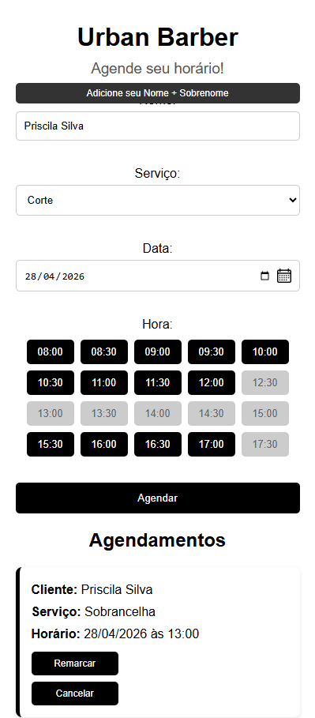

# 💈 Barbershop Management System

A web application for managing barbershop appointments with intelligent scheduling, conflict validation, and real-time availability.

---

## 📌 Project Overview

This project is a web-based system designed to help barbershops manage appointments efficiently. It replaces manual scheduling with an automated system that prevents time conflicts, considers service duration, and improves organization.

---

## 🚀 Evolução da Arquitetura: Projeto Integrador II (PI II)

A partir desta etapa, o projeto passa por uma reformulação arquitetural para atender aos novos requisitos de engenharia de software, desacoplamento e escalabilidade:

1. **Modelagem de Dados Relacional Normalizada:**
   - Transição de tabela plana única para esquema relacional normalizado com tabelas `servicos`, `clientes` e `agendamentos_v2`.
   - Implementação de integridade referencial com Chaves Estrangeiras (`FOREIGN KEY`) e deleção em cascata (`ON DELETE CASCADE`).
   - Carga inicial automática (seeding) de serviços, durações e preços tabelados.

2. **Endpoints de API RESTful (JSON):**
   - Início do desacoplamento entre frontend e backend.
   - `GET /api/v1/servicos`: Listagem de serviços cadastrados.
   - `GET /api/v1/horarios-disponiveis`: Cálculo dinâmico e validação de janelas livres por serviço e data.
   - `POST /api/v1/agendamentos`: Criação de agendamentos consumindo payloads JSON com vínculo automático de clientes.

3. **Garantia de Qualidade e Testes Automatizados:**
   - Cobertura de testes unitários automatizados via `unittest` em `test_app.py` validando contratos de API, códigos de status HTTP (200, 201, 400, 404) e integridade dos dados retornados.

---

## 🎯 Features (PI I & PI II)

- Create appointments (booking)
- View appointments filtered by date
- Update appointments (reschedule)
- Delete appointments (cancel)
- Intelligent time-slot blocking based on service duration and business constraints
- **[New - PI II]** RESTful API endpoints for external clients and decoupled frontends
- **[New - PI II]** Automated unit test suite

---

## 🧠 Business Rules Implemented

- Service duration affects availability dynamically
- No overlapping appointments allowed
- Business hours: 08:00 – 18:00 (Tuesday to Saturday)
- Time slots dynamically calculated and disabled when unavailable

---

## 🛠 Technologies

- **Backend:** Python (Flask)
- **API Architecture:** RESTful (JSON)
- **Database:** SQLite (Relational Schema com Foreign Keys)
- **Testing:** Python `unittest`
- **Frontend:** HTML5, CSS3, JavaScript (WCAG accessible)
- **Server / Deployment:** Gunicorn / Cloud

---

## 📂 Project Structure

```text
├── static/              # CSS stylesheets, UI scripts, assets
├── templates/           # HTML templates (Jinja2)
├── images/              # Documentation and report figures
├── app.py               # Application core, relational schema, MVC and REST API routes
├── test_app.py          # Automated unit test suite
├── barbearia.db         # Local SQLite database
└── requirements.txt     # Python project dependencies
```

## 🚀 How to Run & Test

```bash
# 1. Clone the repository
git clone [https://github.com/prgalhardo/barbershop-management-system.git](https://github.com/prgalhardo/barbershop-management-system.git)
cd barbershop-management-system

# 2. Set up virtual environment
python3 -m venv venv
source venv/bin/activate

# 3. Install dependencies
pip install -r requirements.txt

# 4. Run automated tests (PI II)
python3 test_app.py

# 5. Run local application
python3 app.py
```

## 📸 Preview

